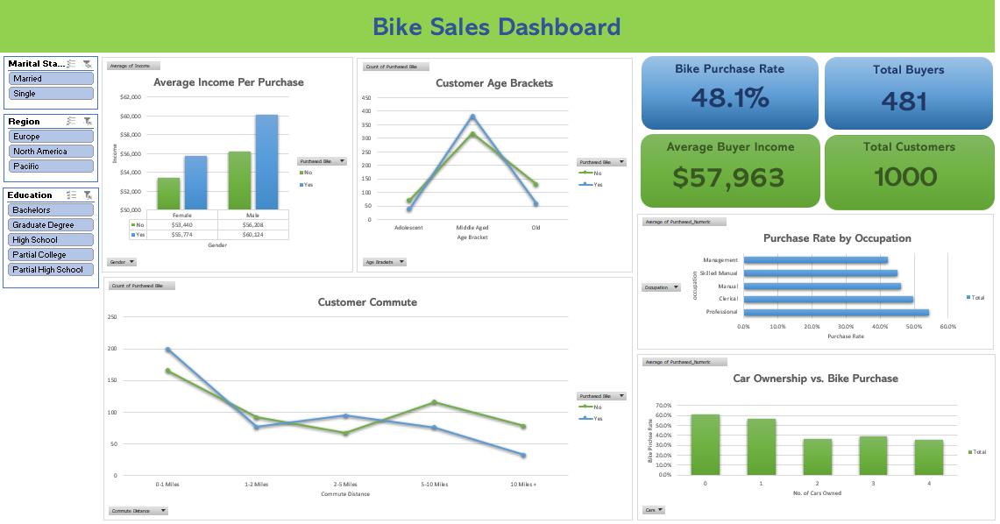

# 🚲 Bike Sales Analytics Dashboard

An interactive Microsoft Excel dashboard analyzing customer demographic and socio-economic data to identify the primary drivers behind bike purchases. The dashboard transforms raw survey data into actionable business insights using dynamic Pivot Tables, conversion rate metrics, and interactive slicers.

---

## 🖥️ Dashboard Preview



---

## 📌 Project Overview

Understanding consumer purchasing behavior is essential for targeted marketing and product positioning. This project explores a dataset of 1,000 potential customers across multiple regions, assessing factors such as income, commute distance, age, car ownership, and profession to evaluate customer conversion.

---

## 📊 Data Source & Provenance

* **Origin:** Microsoft AdventureWorks Sample Database (Customer Demographics / Target Mail dataset).
* **Dataset Benchmark:** Publicly accessible **Bike Buyers Dataset** hosted on Kaggle and GitHub, widely utilized for business intelligence, exploratory data analysis (EDA), and spreadsheet modeling.
* **Volume:** 1,000 customer records spanning 13 demographic and socioeconomic attributes.

---

## 🎯 Key Metrics & KPIs

| Metric | Value | Description |
| :--- | :--- | :--- |
| **Total Surveyed Customers** | **1,000** | Overall volume of unique customer records evaluated. |
| **Total Bike Buyers** | **481** | Total number of customers who completed a purchase. |
| **Bike Purchase Rate** | **48.1%** | Overall conversion rate across the dataset. |
| **Avg. Buyer Income** | **$57,963** | Mean annual income of customers who purchased a bike. |

---

## 🔍 Key Insights & Visualizations

* **Income vs. Purchase Behavior:** Higher earning power correlates positively with bike purchases. Across both genders, buyers hold a consistently higher average income ($57.9k vs. $54.9k for non-buyers).
* **Commute Distance Impact:** Short-distance commuters (0–1 miles) represent the largest volume of bike buyers. Long-distance commuters (5+ miles) exhibit a sharp decline in bike adoption.
* **Demographic Breakdown:** Middle-aged adults (31–54) comprise the core buyer demographic by total volume compared to adolescent and older segments.
* **Occupation & Conversion:** Professional and clerical segments yield higher relative purchase rates compared to manual labor categories.
* **Car Ownership Inverse Relation:** Customers owning 0 to 1 cars have significantly higher conversion rates, indicating bikes serve as a primary commuting substitute rather than strictly leisure gear.

---

## 🛠️ Data Pipeline & Excel Techniques Used

* **Data Cleaning & Preprocessing:** 
  * Handled missing values, formatted currency fields, and categorized continuous age metrics into discrete age brackets (`Adolescent`, `Middle Aged`, `Old`).
  * Added binary indicator helper columns (`Purchased_Numeric = IF(Purchased="Yes", 1, 0)`) for exact conversion probability calculations.
* **Pivot Tables & Calculations:** Built dynamic aggregation models summarizing metrics by demographic groups and applied `GETPIVOTDATA` referencing.
* **Interactive Dynamic UI:** 
  * Implemented connected **Slicers** across *Marital Status*, *Region*, and *Education* to dynamically filter all visualizations simultaneously.
  * Created custom KPI shape cards linked directly to Pivot Table cells for real-time statistical updates.

---

## 📁 Repository Structure

```text
Bike-Sales-Analytics-Dashboard/
│
├── Bike Sales Analytics Dashboard.xlsx   # Main interactive workbook (Dashboard, Pivot Tables, Working Sheet)
├── bike_dataset.xlsx                     # Raw source dataset containing original customer survey records
├── bike_sales_dashboard_preview.png      # A screenshot of the dashboard in Excel
└── README.md                             # Comprehensive project documentation
